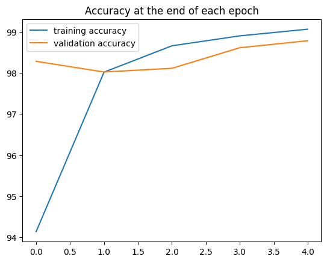
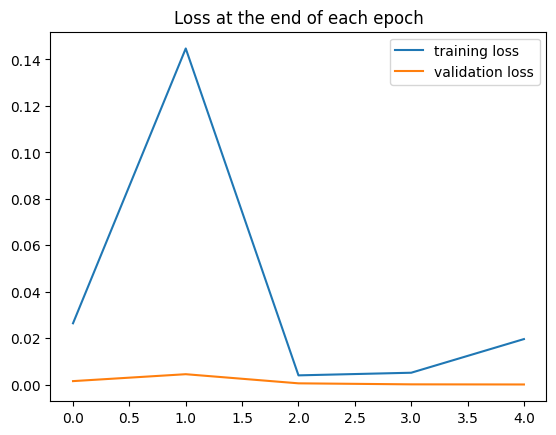

# 🧠 Convolutional Neural Network for MNIST

## 🚀 Overview
This repository contains a PyTorch implementation of a **Convolutional Neural Network (CNN)** for classifying handwritten digits from the **MNIST dataset**. The model is trained using **supervised learning** and achieves high accuracy through convolutional feature extraction.

## ✨ Features
✅ **Built with PyTorch** - Uses PyTorch for defining and training the CNN.  
✅ **Uses MNIST Dataset** - Standard dataset of handwritten digits.  
✅ **Convolutional Layers** - Feature extraction using `Conv2d`.  
✅ **Max Pooling** - Reduces spatial dimensions and prevents overfitting.  
✅ **Fully Connected Layers** - Maps features to digit classes (0-9).  
✅ **Training & Evaluation** - Tracks accuracy and loss metrics.  
✅ **Confusion Matrix** - Evaluates misclassifications.  

## 📦 Installation
To set up the environment, install the required dependencies using:

```bash
pip install torch torchvision numpy pandas matplotlib scikit-learn
```

## 📊 Dataset
The MNIST dataset is automatically downloaded via `torchvision.datasets`. It consists of **60,000 training images** and **10,000 test images**, each **28×28 pixels** in grayscale.

## 🏗️ Model Architecture
The CNN consists of:
1. **Convolutional Layer 1**: 6 filters (3×3 kernel), ReLU activation
2. **Max Pooling 1**: 2×2 pool size
3. **Convolutional Layer 2**: 16 filters (3×3 kernel), ReLU activation
4. **Max Pooling 2**: 2×2 pool size
5. **Fully Connected Layer 1**: 400 → 120 neurons (ReLU activation)
6. **Fully Connected Layer 2**: 120 → 84 neurons (ReLU activation)
7. **Output Layer**: 84 → 10 neurons (Log Softmax for classification)

## 🏃‍♂️ Usage
### 🎯 Training the Model
Run the following script to train the model:

```bash
python cnnmnist.py
```

### 📈 Evaluating the Model
After training, you can evaluate the model's performance using:

```bash
python cnnmnist.py --evaluate
```

## 📌 Results
The model is evaluated based on:
- **Accuracy**: Percentage of correctly classified digits.
- **Loss Curve**: Tracks training and validation loss.
- **Confusion Matrix**: Highlights misclassifications.

### 📊 Accuracy & Loss Plots



### 🔄 Confusion Matrix
A confusion matrix is generated to analyze misclassified digits.

## 🔗 References
📖 [PyTorch Documentation](https://pytorch.org/docs/stable/index.html)  
📖 [Torchvision MNIST Dataset](https://pytorch.org/vision/stable/datasets.html#mnist)  

## 📜 License
📝 This project is licensed under the **MIT License**. Feel free to modify and use it!
